# ICJIA Public Website Redesign — Executive Summary

**Audience:** Agency directors, program managers, non-technical leadership
**Status:** v1.0
**Last updated:** 2026-04-23

This document is written in plain language. Readers with a technical background may want `02-MASTER-DESIGN-PLAN.md` instead.

---

## 1. What we're doing

We are rebuilding icjia.illinois.gov from scratch. The public-facing site will be faster, easier for staff to update, and will meet stricter accessibility standards for Illinois residents who depend on assistive technology. Behind the scenes, we are also upgrading the content-management system (the tool staff use to edit pages) from a version that is no longer supported to the current version.

This is not a visual refresh. It is a full replacement of both the public website and the editing tool it runs on. The existing website stays online until the new one is ready; they run in parallel for a few weeks before the switch.

## 2. Why now

Three reasons, in plain terms:

- **The current site is slow on phones.** We have measured it. Many pages take several seconds to become usable on a typical mid-range phone, which is how most Illinois residents reach us. No amount of tuning will fix this — it is a limit of how the current site is built.
- **The underlying technology is past end-of-life.** The content-management tool (Strapi) we use is running an older version that no longer receives security updates. Staying on it is a growing risk.
- **Accessibility is being propped up with workarounds.** The current site has two dozen pieces of patchwork code that run on every page to hide markup problems from screen readers and other assistive technology. That approach is fragile. A well-built site doesn't need it.

The right fix for all three is a reset, not another round of repairs.

## 3. What changes for content authors

- **Preview before publish.** Authors will be able to click a "Preview" button in the editor and see exactly what a page will look like on the live site before publishing. This works for every content type — news, events, grants, research, biographies — not just a few.
- **Same workflow, simpler admin.** The roles, permissions, and general editing experience stay the same. The new editor is a cleaner version of the current one, not a different tool entirely. The same people who can edit today will edit after the change.
- **No change to who edits what.** Author accounts, roles, and publishing permissions are carried over.

Authors will receive a short orientation session before the switch, and a hands-on testing period on the new tool before any content goes to the public.

## 4. What changes for site visitors

- **Faster pages.** Visitors on phones, tablets, and older computers will see noticeable improvement. Pages load nearly instantly.
- **Works on low-end phones.** The new site is designed to be usable on the kinds of devices many Illinois residents actually have, not just new hardware.
- **Better accessibility.** Screen-reader users, keyboard-only users, low-vision users, and users who need reduced motion will all see a more considered experience. The site meets state government accessibility standards by design rather than by patchwork.
- **Same addresses.** The URLs visitors have bookmarked will continue to work. Anything that moves is automatically redirected to the new location.

## 5. Timeline shape

The project is organized into two tracks that run in parallel and come together near the end: the visible website rebuild (nine phases), and the behind-the-scenes content-system upgrade (ten phases).

```mermaid
gantt
    title Project timeline shape — durations illustrative, not dates
    dateFormat  X
    axisFormat  %s

    section Website rebuild
    Setup                  :p0, 0, 2w
    Design system          :p1, after p0, 4w
    Site structure         :p2, after p1, 3w
    Homepage               :p3, after p2, 3w
    Page templates         :p4, after p3, 4w
    Content rollout        :p5, after p4, 4w
    Search and admin       :p6, after p5, 3w
    Accessibility polish   :p7, after p6, 3w
    Switch to new site     :p8, after p7, 2w

    section Content-system upgrade
    Inventory              :s0, 0, 1w
    Set up new system      :s1, after s0, 1w
    Rebuild content types  :s2, after s1, 2w
    Move custom features   :s3, after s2, 3w
    Move images and files  :s4, after s2, 1w
    Data-migration script  :s5, after s3, 3w
    Move author accounts   :s6, after s5, 1w
    Integration testing    :s7, after s6, 2w
    Author acceptance      :s8, after s7, 2w
    Switch to new system   :s9, after s8, 1w
```

Total estimate: roughly nine to twelve months of work, depending on how the two tracks align. Firm dates depend on when the content-system upgrade can start, which is the decision we need from leadership first (see §6).

Details: `04-PHASED-DELIVERABLE-PLAN.md`.

## 6. What we need from leadership

- **A decision on who owns the content-system upgrade.** The upgrade is a project in its own right. It needs an owner — agency IT, a contractor, or an internal team — with a target start date. Without this, the website rebuild stalls at about the halfway point.
- **A short conversation with authors.** We want to confirm which content types are still actively edited and which have been unchanged for over a year. This lets us retire editing interfaces that aren't being used and focus the new tool on what staff actually need.
- **An accessibility reviewer.** Either an internal reviewer or an external consultant, engaged early rather than at the end. Accessibility reviews catch problems in days rather than months of retrofitting.
- **A cutover window.** A short, pre-announced low-traffic period for switching from the old site to the new. Two weeks of notice is typical.

## 7. Risks we're managing

Three that are worth naming at the leadership level:

- **The content-system upgrade is on the critical path.** The website rebuild can start without it, but cannot finish without it. If the upgrade starts late, the website rebuild pauses mid-project and waits. The mitigation is to start inventory work on the content system now, in parallel with the website rebuild.
- **Running two sites in parallel takes coordination.** For several weeks before cutover, content changes may need to be made in both the old and new systems. We are minimizing this by pointing both sites at the same content source during the parallel period, but it requires author attention during the overlap.
- **Author workflow changes always need adaptation time.** Even with a simpler editor, the first few weeks after the switch require support. We are planning for this with a short orientation, written guidance, and a named support contact for the first month.

None of these are unusual for a project of this size. They are all managed with planning, not avoided.

## 8. How progress is tracked

- Per-phase task lists and completion gates are in `04-PHASED-DELIVERABLE-PLAN.md`. Each phase has a single question that determines whether it is done.
- Status cadence: weekly written update to stakeholders (cadence and format to be confirmed with leadership).
- Open decisions are tracked in `07-OPEN-QUESTIONS.md`, a living document appended as decisions close.

## 9. Where to read more

See `00-README.md` for reading paths by role — which documents are relevant to which audience and in what order. If you have a specific question this summary did not answer, `00-README.md` points to the right document.
