# ICJIA Public Website — Phased Deliverable Plan

**Status:** DRAFT v0.2
**Companion to:** `02-MASTER-DESIGN-PLAN.md`, `03-STRAPI-UPGRADE-PLAN.md`
**Scope:** Per-phase task lists, entry/exit criteria, deliverables, dependencies, and risk flags for both the website rebuild and the Strapi upgrade tracks
**Last updated:** 2026-04-24 (§2 third compression-factor bullet reworded to attribute schedule to the developer's demonstrable stack experience rather than methodology framing)

---

## How to read this document

Two tracks run in parallel:

- **Nuxt track** (P0–P8): the visible website rebuild. Phases are lifted from `02-MASTER-DESIGN-PLAN.md` §7 and expanded here.
- **Strapi track** (S0–S9): the content-system upgrade. Phases are lifted from `03-STRAPI-UPGRADE-PLAN.md` §4 and expanded here.

The tracks are independent through early phases and converge around Nuxt Phase 4 (core content archetypes), which requires Strapi Phase S7 (integration with Nuxt staging) as its entry gate.

Each phase has: **entry criteria** (what must be true to start), **deliverables** (concrete artifacts), **exit gate** (the one question that answers "done?"), **dependencies** (what blocks this phase), and **risk flags** (known hazards).

Durations in this document are in working days from project start (not calendar dates). Total expected duration is **6–8 weeks** of active work. Firm calendar dates require the project start date to be committed (see `07-OPEN-QUESTIONS.md` Q3 resolution for the Strapi ownership dependency).

---

## 1. Dependency shape

```mermaid
gantt
    title Phase dependencies — working days from project start
    dateFormat  X
    axisFormat  Day %s

    section Nuxt track
    P0 Scaffold              :p0, 0, 2d
    P1 Design system         :p1, after p0, 7d
    P2 Shell & IA            :p2, after p1, 4d
    P3 Homepage              :p3, after p2, 4d
    P4 Content archetypes    :p4, after p3, 5d
    P5 Content rollout       :p5, after p4, 5d
    P6 Search & admin        :p6, after p5, 3d
    P7 A11y & polish         :p7, after p6, 4d
    P8 Cutover               :p8, after p7, 2d

    section Strapi track
    S0 Inventory             :s0, 0, 1d
    S1 Provision v5          :s1, after s0, 1d
    S2 Schemas               :s2, after s1, 2d
    S3 Custom code           :s3, after s2, 3d
    S4 Media                 :s4, after s2, 1d
    S5 Migration script      :s5, after s3, 3d
    S6 Users & perms         :s6, after s5, 1d
    S7 Integration with P3+  :s7, after s6, 2d
    S8 Author UAT            :s8, after s7, 3d
    S9 Strapi cutover        :s9, after s8, 1d

    section Gates
    S7 must be done before P4 :milestone, g1, after s7, 0d
```

Total shape: **approximately 6–8 calendar weeks** from project start to public cutover. The Nuxt track runs roughly 7 working weeks; the Strapi track runs roughly 3.5 working weeks in parallel. The critical path (see §2) is about 6 working weeks.

The critical coupling: **Nuxt Phase 4 cannot start until Strapi Phase S7 is complete.** Nuxt Phases 0–3 run against stubbed or mock data and do not block on the Strapi track. Nuxt Phases 6–8 depend on S7 and S8 being stable.

## 2. Critical path and slack

The project's critical path runs through:

**S0 → S1 → S2 → S3 → S5 → S7 → P4 → P5 → P7 → P8** (approximately 31 working days, or 6 working weeks).

Why this schedule is compressed compared to traditional estimates:

- **Developer familiarity with the stack.** The developer has built the current ICJIA website and 15+ other sites on the same underlying technology (Vue, JavaScript, TypeScript). Work that would take a new developer weeks of ramp-up — page templates, CMS integration code, data-migration scaffolding, component implementation — takes days when the same patterns have been built, refined, and shipped on prior projects. This is the largest single compression factor; otherwise-multi-week phases collapse to days.
- **`hub-migration-tools` as a starting point** for the Strapi track (see `03-STRAPI-UPGRADE-PLAN.md`). That tool already solves the phase scaffolding, parity audit, and fix-script patterns; adaptation cost is limited to expanding content-type handling.
- **Planning is complete.** The project starts with known requirements, an approved visual direction, and a decided stack — no discovery phase.

Phases with the largest remaining schedule uncertainty:

- **P1 Design system.** The hinge of the Nuxt track. Design taste requires human iteration that does not compress the same way code generation does. If P1 is half-done when page-building starts, every page reworks when the tokens or primitives change. Budget conservatively; plan for one round of revisions after P3 validates tokens against real content.
- **P5 Content rollout.** The long tail of one-off pages is a volume problem, not a complexity problem. Inventorying every URL on the current site during P3 is the mitigation.
- **S3 Strapi custom code port.** Size depends on what the S0 inventory surfaces. Projects with more custom controllers and lifecycle hooks take longer. Flag early in S0 if the custom-code surface area is larger than a day or two of work.
- **S8 Author UAT.** Author availability is the schedule risk here, not the work itself. Book sessions at the start of S7, not at the start of S8.

Slack exists in: S4 (media) which runs parallel to S3; S6 (users/perms) which is mostly manual and can compress; P6 (search and admin) which is relatively self-contained.

---

## 3. Nuxt track

### Phase 0 — Decisions and scaffold

**Entry criteria**
- `02-MASTER-DESIGN-PLAN.md` is signed off at v1.0.
- Git repository `icjia-public-nuxt` (or agreed name) is created.
- Hosting account (Netlify) is provisioned with staging environment.

**Deliverables**
- New repository initialized with Nuxt 4.4.x, TypeScript strict, Nuxt UI 4.x, Tailwind v4.
- Lockfiles committed; `pnpm-lock.yaml` or equivalent.
- `nuxt.config.ts` with base SSG configuration, route rules, prerender settings.
- Netlify deployment configured; preview deployments on PR; production target `next.icjia.illinois.gov`.
- ESLint + Prettier configured; `typescript.strict: true` and `typescript.typeCheck: true`.
- CI pipeline skeleton: install, typecheck, lint, build, deploy preview.
- Environment-variable convention documented in repo README.

**Exit gate**
An empty Nuxt 4 app deploys successfully to `next.icjia.illinois.gov`. Clicking a placeholder page loads in under 200ms.

**Dependencies** None.

**Risk flags**
- Tooling drift: pin Nuxt UI and Tailwind versions; document upgrade cadence.

### Phase 1 — Design system

**Entry criteria**
- P0 exit gate met.
- `05-DESIGN-SYSTEM.md` v0.1 is current.
- Mockup HTML and reference render available at [`ui/`](../ui/) (`ICJIA_Redesign_v2_squared.html` and the full-page PNG).

**Deliverables**
- Tailwind v4 `@theme` layer with all color, spacing, typography, and shadow tokens from `05-DESIGN-SYSTEM.md`.
- `app.config.ts` Nuxt UI theme configuration committed.
- Self-hosted Inter and JetBrains Mono via `@nuxt/fonts`, automatic subsetting verified.
- Theme toggle component (dark / light / system) with `prefers-color-scheme` respect and persistence.
- First pass of contrast audit for all documented token combinations; results recorded in `05-DESIGN-SYSTEM.md` §1.4.
- Storybook or Histoire build with a page per primitive: Button, Card (flat variant), Input, Select, Badge, Alert, Skeleton, Kbd, Icon.
- Open decisions in `05-DESIGN-SYSTEM.md` §7 (exact primary shade, icon set, toggle behavior) resolved and recorded.

**Exit gate**
Every primitive listed above renders correctly in both themes, passes contrast checks, and has a Storybook/Histoire page. A design reviewer signs off.

**Dependencies** P0.

**Risk flags**
- **Hinge phase.** Compromises here cascade through every later page. Do not compress this phase to rescue the schedule.
- Contrast audit may surface token changes (e.g., primary shade nudge) that invalidate early Storybook pages — budget for one revision pass.

### Phase 2 — Shell and information architecture

**Entry criteria**
- P1 exit gate met.
- Navigation structure from `02-MASTER-DESIGN-PLAN.md` §3.1 is confirmed with stakeholders.

**Deliverables**
- Global shell components: header, footer, primary nav, mobile drawer, search-modal trigger.
- Skip link as first tab-focusable element.
- Site banner (dismissible, `sessionStorage`-backed).
- Route announcer (`aria-live="polite"`) component.
- Breadcrumb component (used on detail and resource pages).
- Mobile drawer with focus trapping, Esc-to-close.
- Placeholder routes for every top-level nav item (About, Research, Grant Resources, Partners, News).
- `public/_redirects` skeleton with the first handful of legacy URL entries.
- URL structure locked: `/news`, `/events`, `/grants`, `/researchhub`, `/irb`, `/admin`, etc.

**Exit gate**
A user can navigate the full shell structure using keyboard only. Screen reader (VoiceOver or NVDA) announces each route change. No content on any page — just shell.

**Dependencies** P1.

**Risk flags**
- Nav structure changes later cascade into sitemap, redirects, and breadcrumb logic — push stakeholder sign-off into this phase.

### Phase 3 — Homepage

**Entry criteria**
- P2 exit gate met.
- Stubbed or mock data available for hero content, news ribbon, grants, research.
- Homepage copy approved by communications lead.

**Deliverables**
- Homepage hero component (static with three image variants per `07-OPEN-QUESTIONS.md` Q6).
- News ribbon component with mock data; pagination or "see all" link.
- Quick-links tabs component.
- Research grid component.
- Stats component.
- Responsive behavior verified at 320px, 768px, 1024px, 1440px, 1920px.
- Homepage passes automated accessibility gates.
- Homepage visible on staging with mock data.

**Exit gate**
Homepage renders end-to-end on staging with mock data. Keyboard- and screen-reader-accessible. Loads instantly on throttled mobile network.

**Dependencies** P2. May use Strapi S7 output if available, otherwise mock data.

**Risk flags**
- Hero carousel decision (`07-OPEN-QUESTIONS.md` Q6) must be closed in this phase, not deferred.

### Phase 4 — Core content archetypes

**Entry criteria**
- P3 exit gate met.
- **Strapi S7 exit gate met** (Nuxt staging app queries v5 successfully via GraphQL).

**Deliverables**
- Listing page template (news/index pattern): paginated or filtered list of cards.
- Detail page template (news/[slug] pattern): Markdown body rendering, metadata, related items.
- Resource page template (policies, required-forms): table with download links.
- Profile page template (unit, biography): person/team information layout.
- Preview-mode end-to-end on at least one content type: Strapi "Preview" button → signed URL → Nuxt Function → draft rendered with preview banner → "Leave preview" clears cookie and returns to static site.
- Data composables (`useStrapi` GraphQL client, `useContent` for `@nuxt/content`) with typed query outputs.
- Build-time content validators for heading order, missing alt text, empty H1s (per `06-ACCESSIBILITY-STRATEGY.md` §2).
- One route per archetype live on staging with real Strapi 5 data.

**Exit gate**
One route per archetype renders from real Strapi 5 data. At least one author successfully previews an unpublished draft end-to-end.

**Dependencies** P3 (Nuxt track) AND S7 (Strapi track). **This is the critical gate where the two tracks converge.**

**Risk flags**
- If S7 slips, this phase starts late and pushes cutover by the slippage amount. Flag the coupling in every status update from P2 onward.
- Preview-mode architecture (per `02-MASTER-DESIGN-PLAN.md` §4.5) is one of the few places where the two systems' security models overlap. Authentication review is non-optional.

### Phase 5 — Content rollout

**Entry criteria**
- P4 exit gate met.
- All content types inventoried in Strapi S0 have a v5 equivalent (S2 exit).

**Deliverables**
- Every editor-driven content type (news, events, grants, research articles, datasets, apps, biographies, unit pages) rendered on `next.icjia.illinois.gov`.
- Preview URLs configured in Strapi per content type (configuration stored in the Strapi admin, not in code).
- `@nuxt/content` routes for stable content (policies, about pages, navigation config, redirect tables).
- `public/_redirects` populated for every URL that exists on the current site. No orphan URLs.
- Sitemap (`@nuxtjs/sitemap`) includes every public URL.
- Robots configuration (`@nuxtjs/robots`) correct for `next.icjia.illinois.gov` (noindex until cutover) and for production (indexable).

**Exit gate**
URL coverage matches the current site. Every editor-driven content type is previewable by its authors on `next.icjia.illinois.gov`.

**Dependencies** P4, S2 (schemas), S5 (migrated content in v5).

**Risk flags**
- Volume phase. Underestimating the long tail of one-off pages is common. Inventory every URL on the current site during P3.

### Phase 6 — Search and admin

**Entry criteria**
- P5 exit gate met.
- Search backend decision resolved (`07-OPEN-QUESTIONS.md` Q1).
- Admin audit complete (`07-OPEN-QUESTIONS.md` Q7).

**Deliverables**
- Build-time `searchIndex.json` generation.
- Search modal (Cmd+K) with Fuse.js runtime or Pagefind per Q1 resolution.
- Admin routes (`/admin/**`) configured as `ssr: false` / SPA mode.
- Admin authentication flow (Strapi auth, token exchange via REST).
- Admin views ported per Q7 audit (anything without an identified current user is retired, not ported).

**Exit gate**
Feature parity on search and gated surfaces. Authors log into admin and complete their documented workflows.

**Dependencies** P5, S7.

**Risk flags**
- Admin is the most common site of silent requirement creep. Hard-close Q7 before this phase starts.

### Phase 7 — Accessibility and polish

**Entry criteria**
- P6 exit gate met.
- External accessibility reviewer engaged (if using one).

**Deliverables**
- Full accessibility audit completed per `06-ACCESSIBILITY-STRATEGY.md` §3 and §4.
- Every issue from the audit is resolved or has a documented acceptance rationale.
- VoiceOver and NVDA passes on all critical paths, in both light and dark modes.
- Keyboard-only pass on every interactive surface.
- 200%-zoom pass on critical reading paths.
- `prefers-reduced-motion` pass.
- Print styles for government content (policies, forms, grant documents).
- Lighthouse mobile ≥95 on five sampled pages.
- Visual polish pass: spacing consistency, typography rhythm, motion tuning.
- Build-time content validators pass on current production content (per `06-ACCESSIBILITY-STRATEGY.md` §2).

**Exit gate**
All cutover criteria in `02-MASTER-DESIGN-PLAN.md` §6.2 are met except the two-week parallel-operation criterion.

**Dependencies** P6.

**Risk flags**
- Accessibility findings can surface changes to the design system (P1). Resist the urge to patch at the page level; fix at the token or component level where possible.

### Phase 8 — Cutover

**Entry criteria**
- P7 exit gate met.
- Strapi S9 exit gate met (v5 is authoritative; v3 is frozen).
- Cutover window agreed with leadership (see `01-EXECUTIVE-SUMMARY.md` §6).

**Deliverables**
- A/B traffic split at 10% to `next.icjia.illinois.gov` for one week; Plausible analytics verified against expected patterns.
- All six cutover criteria in `02-MASTER-DESIGN-PLAN.md` §6.2 checked off.
- DNS swap: `icjia.illinois.gov` points at the new site.
- Old site at `legacy.icjia.illinois.gov` for one release cycle post-cutover.
- Rollback plan documented and tested (DNS reverse within 15 minutes).
- Post-cutover monitoring cadence: Plausible, Netlify analytics, Strapi admin logs, error tracking.

**Exit gate**
The new site is the production site. The old site is archived. No critical regressions in the first 72 hours.

**Dependencies** P7, S9.

**Risk flags**
- Low-traffic-window coordination with the agency calendar. Avoid state legislative session dates and major agency events.

---

## 4. Strapi track

### Phase S0 — Inventory

**Entry criteria**
- Strapi upgrade ownership decision is made (`07-OPEN-QUESTIONS.md` Q3 has an owner).
- Read access to the production v3 instance, including admin and database.

**Deliverables**
See `03-STRAPI-UPGRADE-PLAN.md` §2 for the full audit checklist. At minimum: content types, components, dynamic zones, custom code file-by-file, plugins, media summary, user/role matrix, webhooks, env vars, DB engine and version.

**Exit gate**
Signed inventory document. The backend owner confirms it matches production state.

**Dependencies** Q3 ownership resolved.

**Risk flags**
- If the inventory surfaces a larger custom-code surface area than expected, re-scope S3 before committing to the timeline. (v3 engine is known: SQLite.)

### Phase S1 — Provision Strapi 5

**Entry criteria**
- S0 exit gate met.
- Hosting target confirmed for v5 instance.
- SQLite database file provisioned for v5 (separate from v3's database). Backup cadence for the SQLite file agreed with agency IT.

**Deliverables**
- Fresh Strapi 5 installation (latest LTS at project start).
- Node version aligned with Strapi 5 requirements; version locked.
- CI/CD pipeline: PR preview, staging deploy, production deploy gated behind cutover.
- Environment variables configured (database URL, secrets, storage provider).
- Admin access configured; at least one admin account active.

**Exit gate**
`strapi start` reaches admin login on the staging URL. A fresh admin account can log in and see the empty admin UI.

**Dependencies** S0.

**Risk flags** Minimal; this phase is the most predictable.

### Phase S2 — Schemas

**Entry criteria**
- S1 exit gate met.
- Inventory document from S0 is current.

**Deliverables**
- Every v3 content type rebuilt as a v5 content type with like-for-like fields, relations, and components.
- Every v3 component rebuilt in v5.
- Every v3 dynamic zone rebuilt with the same permitted components.
- Schemas committed to the Strapi 5 repository.
- Staging v5 instance reflects all schemas; admin can create entries of every type.

**Exit gate**
Every v3 content type has a v5 equivalent checked into git. An engineer can create a sample entry of each type without error.

**Dependencies** S1, S0 inventory.

**Risk flags**
- Do not redesign schemas during S2. Like-for-like only. Redesign is deferred to post-launch work.

### Phase S3 — Custom code

**Entry criteria**
- S2 exit gate met.
- Custom-code list from S0 is reviewed and triaged (keep, drop, replace).

**Deliverables**
- Every kept custom controller ported to v5 patterns.
- Every kept lifecycle hook rewritten as a v5 Document Service middleware or per-content-type lifecycle.
- Every kept service/policy ported.
- Plugins replaced with v5 equivalents where they exist; custom replacements written where they don't.
- Unit tests cover the ported behavior; integration tests cover Document Service operations.

**Exit gate**
Ported behaviors match v3 spot-checks. Unit tests pass.

**Dependencies** S2.

**Risk flags**
- Largest schedule uncertainty in the Strapi track. If the custom-code surface is larger than expected, this phase absorbs the slip.

### Phase S4 — Media

**Entry criteria**
- S2 exit gate met (schemas reference media fields).
- Storage provider decision made (S3-compatible bucket configured).

**Deliverables**
- v5 upload provider configured (S3-compatible).
- If v3 was local-filesystem: files copied to the new bucket; checksums verified; path structure preserved.
- If v3 was already S3: v5 instance configured to read from the same bucket and path prefix.
- A sample of production upload URLs resolves correctly when served through v5.

**Exit gate**
A v3 upload URL resolves against the v5 instance without 404 or URL rewriting.

**Dependencies** S2.

**Risk flags**
- If v3 is local-filesystem, file-copy time for large media sets is non-trivial. Measure during S0.

### Phase S5 — Data migration script

**Entry criteria**
- S3 exit gate met.
- S4 exit gate met (so media URLs validate during migration).

**Deliverables**
- Node script implementing the migration pattern in `03-STRAPI-UPGRADE-PLAN.md` §5.
- Idempotent re-runnable from scratch or against a partial v5.
- Dry-run mode against staging v5.
- `v3_id → v5_documentId` mapping file output.
- Structured logging per record.
- Checksum verification report after each run.
- At least three successful dry-runs against staging with full data parity.

**Exit gate**
Record counts match between v3 and v5 after a dry-run; checksum diff is within the defined threshold. The script is idempotent (second run against the same target produces no new writes and no errors).

**Dependencies** S3, S4.

**Risk flags**
- Idempotency bugs cause silent data duplication. Test with deliberate re-runs against partially-populated staging.

### Phase S6 — Users and permissions

**Entry criteria**
- S5 exit gate met (so content exists for permissions to attach to).

**Deliverables**
- Every v3 admin user re-created as a v5 admin user, with the same role.
- Role-to-permissions matrix recreated in v5's permissions model.
- Authentication provider configured (if v3 used external auth, configure v5 the same way).
- Password reset flow tested for at least one user.

**Exit gate**
Every v3 author account has a v5 equivalent with the same role and permissions.

**Dependencies** S5.

**Risk flags**
- Permissions can drift between v3 and v5 because the models differ. Cross-check by asking a sampled author to perform their normal tasks on staging.

### Phase S7 — Integration with Nuxt

**Entry criteria**
- S6 exit gate met.
- Nuxt track has reached P3 (homepage) or later.

**Deliverables**
- Nuxt staging app's GraphQL queries run successfully against v5.
- Every content type used by the Nuxt app has been queried at least once and the response shape matches what the Nuxt app expects.
- Any schema mismatches (missing fields, renamed fields, relation shape differences) are resolved on the Strapi side (not in the Nuxt client).
- Response time for a full-site build-time query pass is within the acceptable range (documented in the integration test report).

**Exit gate**
Every content type renders on `next.icjia.illinois.gov` using real v5 data.

**Dependencies** S6, Nuxt P3.

**Risk flags**
- **This is the gate that unblocks Nuxt P4.** Every day of slippage here is a day of slippage for cutover. Flag risk early.

### Phase S8 — Author acceptance testing

**Entry criteria**
- S7 exit gate met.
- At least three authors available, representing different content areas.

**Deliverables**
- Every author completes the end-to-end publish workflow: draft → preview via Nuxt → upload media → edit relations → publish → unpublish → edit published → republish.
- Usability issues recorded with severity.
- Blocking issues resolved before S8 exit.
- Written sign-off from each participating author.

**Exit gate**
Three or more authors sign off on the publish workflow for their content types.

**Dependencies** S7, Nuxt P4 (preview-mode end-to-end wired).

**Risk flags**
- Author availability is a scheduling risk. Book sessions at the start of S7, not at the start of S8.

### Phase S9 — Strapi cutover

**Entry criteria**
- S8 exit gate met.
- Nuxt track has reached P7 or can reach P7 within the S9 window.
- Cutover window agreed with leadership.

**Deliverables**
- Final data-migration dry-run against a fresh copy of v3 production data.
- Final production migration run during the cutover window.
- Strapi admin DNS (if separate) points at v5.
- Nuxt production builds point at v5.
- v3 instance is frozen: read-only access retained for the 30-day retention window.
- Post-cutover monitoring confirms v5 is stable.

**Exit gate**
v5 is the canonical content source. v3 is frozen and read-only. Authors can log in to v5 and publish.

**Dependencies** S8.

**Risk flags**
- A failed cutover rolls back to v3 and retries in the next window. The first attempt is not the last chance; avoid the temptation to force through problems.

---

## 5. Cross-track convergence summary

- **S7 → P4.** Nuxt Phase 4 cannot start until Strapi Phase S7 is complete. This is the single hard gate between tracks.
- **S8 ↔ P4.** Author acceptance testing needs preview-mode to be wired end-to-end, which is a P4 deliverable. Sequence S8 after P4 reaches its exit gate.
- **S9 → P8.** The Strapi cutover happens *before* the frontend cutover. They are separate events. At S9, v5 becomes canonical; the Nuxt production deployment then points at v5; then P8 executes the DNS swap for the public site.

This sequencing means there is a period — usually a few days — when v5 is canonical and the old Vue 2 production site is still pointing at v5 (via the same Strapi URL, which is deliberately preserved). This is by design: the existing production site keeps working against the new backend while the new frontend prepares for cutover.

---

## 6. What this document does not cover

- Test plan. Pending in `TEST-PLAN.md` (forthcoming). That document will cover test strategy, coverage targets, automation approach, and the specific test procedures referenced here.
- Specific calendar dates. Durations are in working days from project start; total is 6–8 weeks of active work. Firm calendar dates require the project start commitment (see `07-OPEN-QUESTIONS.md` Q3).
- Post-launch work. Strapi 6, bilingual content, schema redesign, and related post-v1 initiatives are tracked separately.
